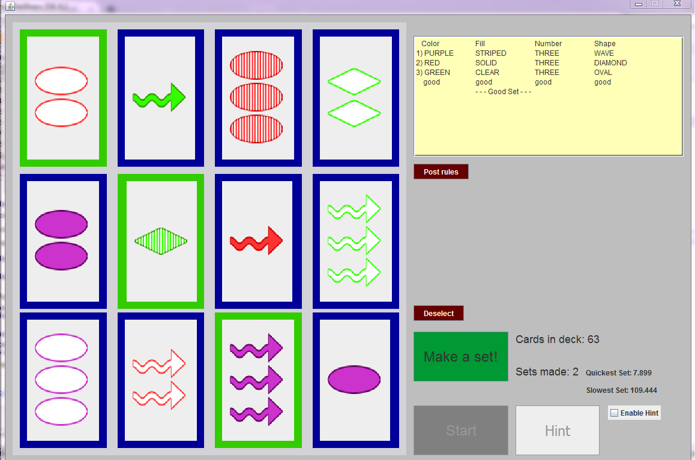

# Set-Game
A java based game I made after playing the card game Set. I did not invent the game idea, this is simply a single person game that is made arond the concept of the game. The website for the original set game is here (http://www.setgame.com/)

A .jar file will be here if you want to play the game.

To compile this program all images, sound, and java files should live in the same folder.
Full netbeans project included.

I appologize if any aspects of the game don't look good on your computer. Attached is a picture of how it runs on my computer

